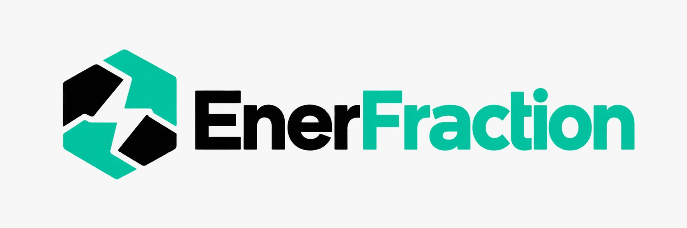
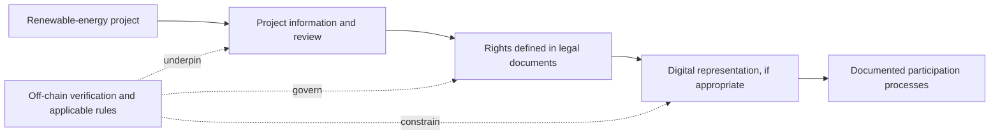

# EnerFraction

  

  <strong>Connecting renewable-energy infrastructure with more accessible digital participation.</strong>

  Santander X Challenge | University Challenge 2026

---

## Project description

EnerFraction is a digital platform that tokenizes, digitizes, and structures renewable energy assets such as solar parks, wind farms, and battery energy storage systems (BESS). The platform connects renewable energy projects with investors by creating digital representations of economic and contractual rights through smart contracts that help automate fundraising, purchase execution, and profit distribution. This enables capital to flow toward sustainable energy projects while improving transparency, liquidity, and operational efficiency.

The model is designed to align financing with SDG 7 and SDG 9 by supporting the deployment of clean-energy infrastructure and creating more accessible pathways for investor participation in the energy transition.

## Problem statement

The energy transition requires large-scale deployment of clean-energy infrastructure, including solar and wind projects that generate low-carbon electricity. However, project owners and asset managers often face barriers to accessing the capital needed to develop and operate these assets. At the same time, investors have limited access to clear, transparent, and flexible ways to participate in renewable infrastructure financing.

Long-term contracts and complex financing frameworks can restrict capital participation and reduce diversification of funding sources. Blockchain technology can help create transparent asset records and fractional investment structures, improving access to capital and broadening investor inclusion.

## The challenge

The energy transition depends on building and operating clean-energy infrastructure. Solar and wind projects can demand substantial capital upfront and take years to develop. The organizations bringing these assets to life may struggle to access financing, while potential investors may have few approachable ways to participate.

Long-term agreements, complex financing structures and high participation thresholds can make it harder to bring different sources of capital together. The result is a gap between the scale of investment clean-energy infrastructure needs and the opportunities available to participate in it.

## The EnerFraction approach

EnerFraction explores whether real-world asset (**RWA**) tokenization could help organize participation around renewable-energy projects. A digital token would be considered only as a representation of specific economic or contractual rights established in the project documents—not as a substitute for those rights or documents.

In principle, a responsibly structured project could bring together:

1. **A real project** — solar, wind or energy-storage infrastructure, supported by relevant project information.
2. **Clearly defined rights** — an appropriate legal and financial structure that explains exactly what participation does and does not mean.
3. **A traceable digital record** — a possible on-chain representation linked to the documented rights.
4. **Rules-based processes** — where appropriate, smart contracts could help coordinate records, transfers or distribution calculations according to documented rules.

Blockchain can provide a traceable record of digital transactions; it cannot, by itself, confirm that a power plant exists, verify its performance, establish rights to a physical asset or satisfy legal requirements. Those connections depend on reliable evidence, project documentation and the rules that apply to each offering and jurisdiction.

## Why renewable energy is suitable for RWA tokenization

Renewable energy infrastructure has characteristics that make it relevant for real-world asset (RWA) tokenization:

- **Large capital requirements:** Developing solar parks, wind farms, and storage projects often requires substantial upfront financing.
- **Long-term cash flows:** Renewable assets commonly operate under long-term revenue arrangements, including power purchase agreements and asset-linked contracts.
- **Fractional participation:** Traditional infrastructure investments can require large minimum commitments. A tokenized structure may allow smaller, more accessible participation units when legally and structurally appropriate.
- **Transparent records:** Blockchain can offer a shared transaction ledger for asset-linked digital records, improving traceability and accountability.
- **Growing institutional interest:** Asset managers, financiers, and infrastructure stakeholders are increasingly exploring digital infrastructure for asset issuance, reporting, and settlement processes.

## How EnerFraction would work

A robust renewable-energy tokenization model usually depends on several connected layers:

1. **Asset identification and due diligence** — confirm the project, ownership structure, permits, technology, capacity, and financial profile.
2. **Legal and financial structuring** — define what the digital representation means and how it relates to investor rights, project revenues, and legal documentation.
3. **Token design** — determine the digital unit's purpose, rules, constraints, and compliance requirements.
4. **Compliance and investor onboarding** — apply KYC, AML, eligibility checks, sanctions screening, and wallet approval rules.
5. **Issuance and digital records** — create a traceable digital representation linked to the underlying project rights and approved wallets.
6. **Asset and investor management** — maintain ongoing ownership records, reporting, distributions, and operational updates.
7. **Secondary market infrastructure** — where allowed by law and structure, support controlled transfer and settlement flows.

## Core infrastructure we are exploring

EnerFraction is designed around a concept that brings together several layers of infrastructure:

- **Asset management layer:** project documentation, capacity, valuation, operational data, and asset records.
- **Legal structure layer:** the legal entity or special purpose vehicle that defines rights and responsibilities.
- **Tokenization engine:** issuance, transfer logic, supply control, and ownership records.
- **Compliance layer:** onboarding, eligibility checks, restrictions, monitoring, and auditable controls.
- **Custody and wallet layer:** secure wallet access and transaction authorization models.
- **Data and oracle layer:** verified project and performance data to connect the physical asset to the digital record.
- **Investor dashboard:** holdings, project information, transaction history, and reporting views.

## Challenges and constraints

Although tokenization can offer a more digital and transparent model, several challenges remain:

- **Legal ownership vs. digital representation:** a token does not automatically create legal ownership of a physical asset.
- **Asset verification:** blockchain records do not replace due diligence, documentation, audits, or performance verification.
- **Regulatory fragmentation:** rules vary by jurisdiction and asset type.
- **Liquidity constraints:** tokenization does not guarantee a liquid market or immediate tradability.
- **Data reliability:** project data must come from trustworthy, auditable sources.
- **Cybersecurity:** wallets, smart contracts, APIs, and custody systems require careful controls.

These are critical considerations for a responsible renewable-energy financing model.

## Why explore this?

- **More flexible participation:** Digital representations could support smaller, clearly defined units of participation, where permitted.
- **Clearer records:** A shared transaction history could make relevant digital activity easier to follow.
- **Purpose-led infrastructure:** The concept focuses on financing pathways for clean-energy assets.
- **Technology with real-world context:** Digital tools should remain connected to project evidence, human accountability and enforceable documentation.

These are design goals to investigate—not promised benefits, investment returns, liquidity or proof that tokenization alone will increase access to finance.

## Contribution to the energy transition

EnerFraction's ambition connects to the United Nations Sustainable Development Goals:

- **SDG 7 — Affordable and Clean Energy:** Explore financing approaches for renewable-energy infrastructure.
- **SDG 9 — Industry, Innovation and Infrastructure:** Investigate responsible digital innovation for essential infrastructure.

These goals describe the project's intended alignment, not a measured impact claim.

## Project status

EnerFraction is an **early-stage concept**. This repository contains an introductory README and a landing-page prototype. It is **not** a live investment platform and does not issue tokens, onboard investors, process payments, verify energy assets or distribute project profits.

Capabilities described here are ideas for exploration, not operating features or investment opportunities. A token does not automatically provide ownership, income, liquidity or investor protection.
