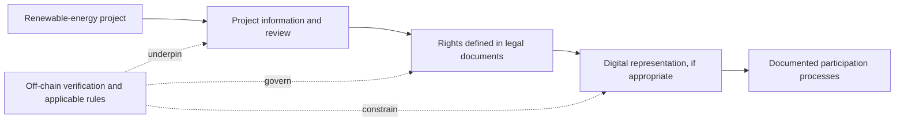

<p align="center">
  
</p>

<h1 align="center">EnerFraction</h1>

<p align="center">
  <strong>Connecting renewable-energy infrastructure with more accessible digital participation.</strong>
</p>

<p align="center">
  <a href="https://yeris003.github.io/EnerFraction/">Explore the project website ↗</a>
  &nbsp;·&nbsp;
  Santander X Challenge | University Challenge 2026
</p>

---

> **The idea:** Explore how clearly defined rights linked to renewable-energy projects could be represented digitally, creating new ways to organize participation in the infrastructure powering the energy transition.

## The project, at a glance

| | |
|:--|:--|
| **Focus** | Renewable energy: solar, wind and battery energy storage (BESS) |
| **Opportunity** | Make project-linked participation more flexible and understandable |
| **Approach** | Connect real-world project information, documented rights and digital records |
| **Stage** | Early-stage concept with a landing-page prototype |

## The challenge

The energy transition depends on building and operating clean-energy infrastructure. Solar and wind projects can demand substantial capital upfront and take years to develop. The organizations bringing these assets to life may struggle to access financing, while potential investors may have few approachable ways to participate.

Long-term agreements, complex financing structures and high participation thresholds can make it harder to bring different sources of capital together. The result is a gap between the scale of investment clean-energy infrastructure needs and the opportunities available to participate in it.

## The EnerFraction approach

EnerFraction explores whether real-world asset (**RWA**) tokenization could help organize participation around renewable-energy projects. A digital token would be considered only as a representation of specific economic or contractual rights established in the project documents—not as a substitute for those rights or documents.

In principle, a responsibly structured project could bring together:

1. **A real project** — solar, wind or energy-storage infrastructure, supported by relevant project information.
2. **Clearly defined rights** — an appropriate legal and financial structure that explains exactly what participation does and does not mean.
3. **A traceable digital record** — a possible on-chain representation linked to the documented rights.
4. **Rules-based processes** — where appropriate, smart contracts could help coordinate records, transfers or distribution calculations according to documented rules.



Blockchain can provide a traceable record of digital transactions; it cannot, by itself, confirm that a power plant exists, verify its performance, establish rights to a physical asset or satisfy legal requirements. Those connections depend on reliable evidence, project documentation and the rules that apply to each offering and jurisdiction.

## Why explore this?

- **More flexible participation:** Digital representations could support smaller, clearly defined units of participation, where permitted.
- **Clearer records:** A shared transaction history could make relevant digital activity easier to follow.
- **Purpose-led infrastructure:** The concept focuses on financing pathways for clean-energy assets.
- **Technology with real-world context:** Digital tools should remain connected to project evidence, human accountability and enforceable documentation.

These are design goals to investigate—not promised benefits, investment returns, liquidity or proof that tokenization alone will increase access to finance.

## Principles we want to get right

**Rights before tokens.** Start with the project structure and the rights documented for participants.

**Verification beyond the blockchain.** Clearly distinguish on-chain transaction records from off-chain facts about assets, permits, construction and performance.

**Transparency by design.** Make it understandable what a digital unit represents, which information supports it, and what risks or restrictions apply.

**Responsible participation.** Any future implementation would require qualified legal and financial advice, appropriate disclosures, investor protections and compliance with applicable laws.

## Contribution to the energy transition

EnerFraction's ambition connects to the United Nations Sustainable Development Goals:

- **SDG 7 — Affordable and Clean Energy:** Explore financing approaches for renewable-energy infrastructure.
- **SDG 9 — Industry, Innovation and Infrastructure:** Investigate responsible digital innovation for essential infrastructure.

These goals describe the project's intended alignment, not a measured impact claim.

## Project status

EnerFraction is an **early-stage concept**. This repository contains an introductory README and a React/Vite landing-page prototype. It is **not** a live investment platform and does not issue tokens, onboard investors, process payments, verify energy assets or distribute project profits.

Capabilities described here are ideas for exploration, not operating features or investment opportunities. A token does not automatically provide ownership, income, liquidity or investor protection.

## Explore the prototype

```bash
cd web
npm install
npm run dev
```

Create a production build with `npm run build`.

## Important notice

This project is for informational and development purposes only. Nothing in this repository is financial, investment, tax or legal advice, or an offer or solicitation to buy or sell a security, token or other financial product. Any future implementation would require project-specific due diligence, legal documentation, risk disclosures and regulatory review.
